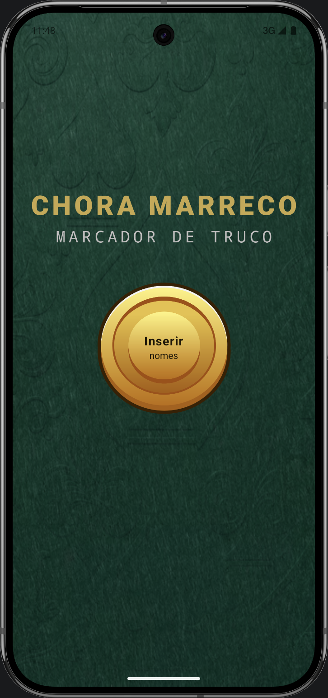
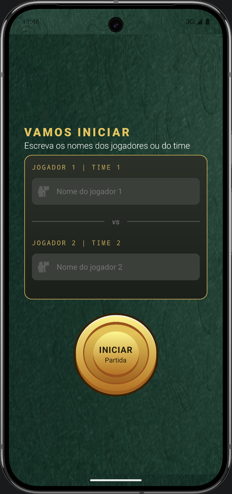
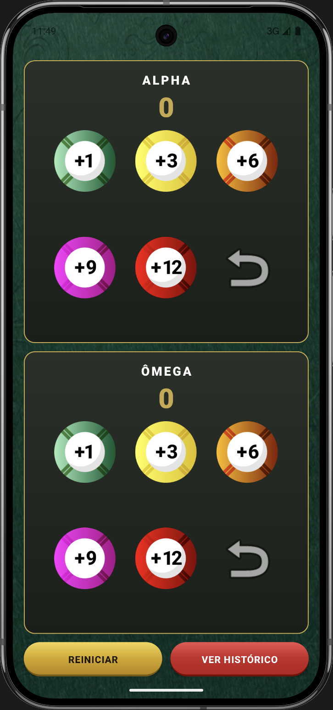
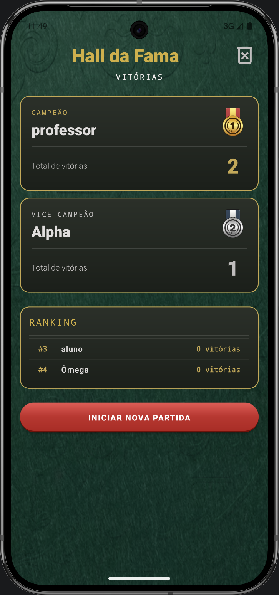

# 🃏 Chora Marreco

Marcador de pontuação para o jogo de Truco, desenvolvido em Android nativo com Kotlin.

---

## 📱 Telas

|                                            Home                                            |                                                Cadastro                                                |
|:------------------------------------------------------------------------------------------:|:------------------------------------------------------------------------------------------------------:|
| <a href="screenshots/home.png"></a> | <a href="screenshots/register.png"></a> |
|                                          **Jogo**                                          |                                             **Histórico**                                              |
| <a href="screenshots/game.png"></a> | <a href="screenshots/history.png"></a>  |

---

## ✨ Funcionalidades

- **Cadastro de jogadores** - informe os nomes antes de iniciar, com fallback automático para nomes
  padrão
- **Marcação de pontos** - fichas de +1, +3, +6, +9 e +12 para cada jogador
- **Desfazer jogada** - botão para reverter a última pontuação adicionada
- **Vitória automática** - ao atingir 12 pontos, o jogo detecta o vencedor e exibe um alerta
- **Histórico de partidas** - salva e exibe quantas rodadas cada jogador ganhou
- **Ranking geral** - lista os jogadores com mais vitórias acumuladas
- **Limpar histórico** - apaga todos os dados salvos com confirmação
- **Suporte a rotação** - layouts distintos para portrait e landscape em todas as telas
- **Splash animada** - animação Lottie na entrada do app

---

## 🛠️ Tecnologias

- **Kotlin**
- **ViewBinding**
- **ConstraintLayout / LinearLayout**
- **Material Design 3** - `TextInputLayout`, `MaterialButton`, `AlertDialog`
- **SharedPreferences** - persistência do histórico de vitórias
- **Lottie** - animação da splash screen
- **AndroidX SplashScreen API**

---

## 🗂️ Estrutura de telas

`SplashActivity` -> animação de entrada
`HomeActivity` -> tela inicial
`RegisterActivity` -> cadastro dos nomes
`GameActivity` -> marcador de pontos
`HistoryActivity` -> histórico e ranking

---

## 🚀 Como rodar

**Pré-requisitos:**

- Android Studio Hedgehog ou superior
- SDK mínimo: API 26 (Android 8.0)

**Passos:**

```bash
# Clone o repositório
git clone https://github.com/seu-usuario/chora-marreco.git

# Abra no Android Studio
File > Open > selecione a pasta do projeto

# Rode no emulador ou dispositivo físico
Run > Run 'app'
```

---

## 📋 Requisitos atendidos

Este app foi desenvolvido como projeto de avaliação da disciplina de Android Básico da UTFPR,
atendendo aos
seguintes requisitos:

| # | Requisitos da avaliação                                            | Status |
|---|--------------------------------------------------------------------|--------|
| 1 | Interface visual com componentes de entrada, processamento e saída | ✅      |
| 2 | Lógica de pontuação com AlertDialog ao atingir 12 pontos           | ✅      |
| 3 | Tela de histórico com partidas ganhas por jogador                  | ✅      |
| 4 | Tela separada para informar os nomes dos jogadores                 | ✅      |
| 5 | Botão para zerar histórico com feedback via Toast                  | ✅      |

---
